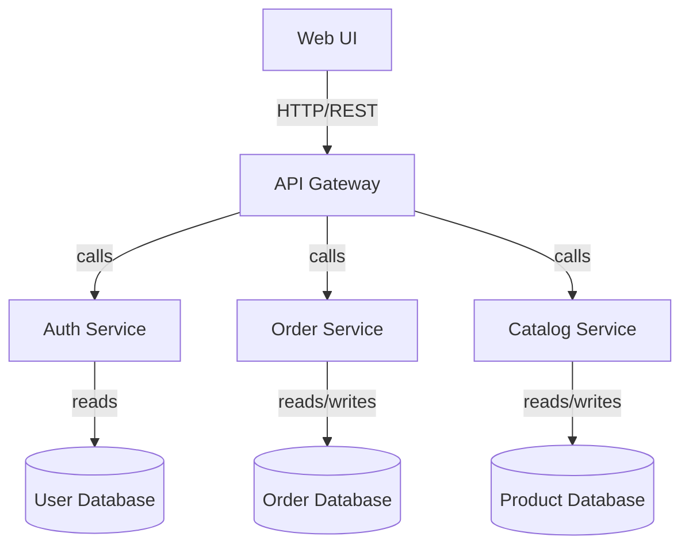
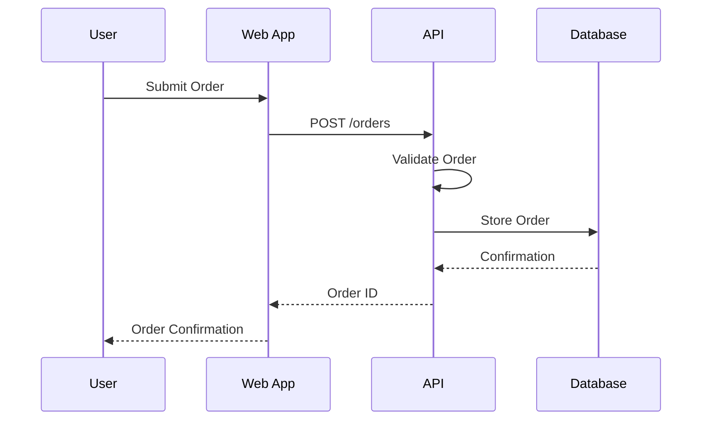
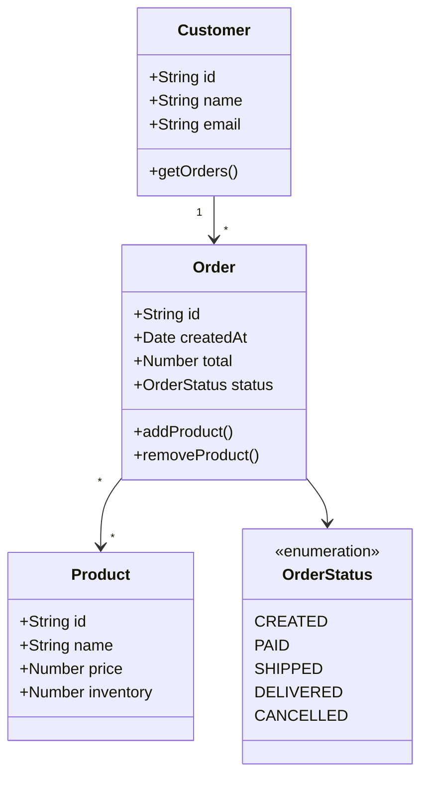
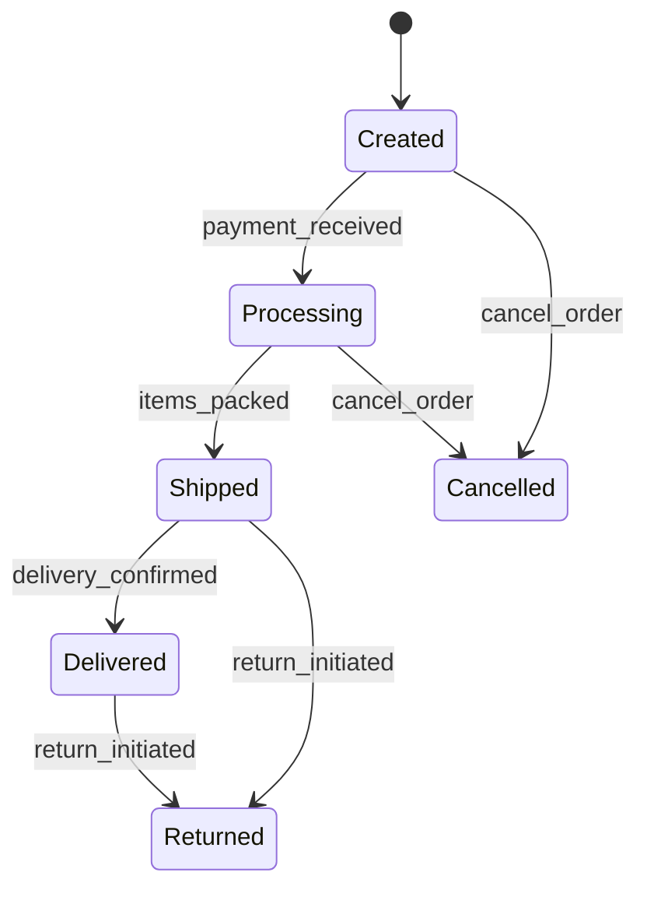

# Architectural Documentation & Design

Effective architectural documentation communicates design intent, supports decision-making, and provides a blueprint for implementation. Follow these guidelines for creating valuable design documentation:

## Architectural Views

Organize your documentation around these complementary views:

### Context View
- Shows the system's relationship with external entities and users
- Defines the system boundaries and key integration points
- Identifies external dependencies and constraints
- Uses context diagrams to visualize the system's place in its environment

### Functional View
- Describes the system's functional elements and their responsibilities
- Outlines key use cases and functional requirements
- Maps business capabilities to system components
- Uses component diagrams and capability maps

### Information View
- Defines the data model and information flow
- Documents entity relationships and data structures
- Specifies data ownership and consistency requirements
- Uses entity-relationship diagrams and data flow diagrams

### Deployment View
- Shows the physical or virtual infrastructure
- Defines runtime components and their deployment targets
- Specifies hardware requirements and network topology
- Uses deployment diagrams and infrastructure schematics

### Development View
- Describes the system from a developer's perspective
- Outlines module organization and code structure
- Defines development standards and practices
- Uses package diagrams and module dependency graphs

## Documentation Best Practices

### Content Guidelines
- Focus on architecturally significant elements
- Document the "why" behind decisions, not just the "what"
- Highlight risks, constraints, and assumptions
- Include considered alternatives and reasons for rejection
- Maintain appropriate detail level (avoid excessive documentation)

### Format & Structure
- Use a consistent template across documents
- Start with an executive summary for each document
- Use diagrams extensively with supporting text
- Include a glossary for domain-specific terminology
- Organize information hierarchically (from high-level to detailed)

### Diagram Guidelines
- Follow standard notation (UML, C4 Model, etc.) consistently
- Keep diagrams focused on a single concern
- Include legends for custom notations
- Use colors and shapes consistently
- Create diagrams at different abstraction levels

## Mermaid Diagram Examples

When visualizing architecture, use Mermaid diagrams like these:

### Component Diagram

### Sequence Diagram

### Class/Entity Diagram

### State Diagram
