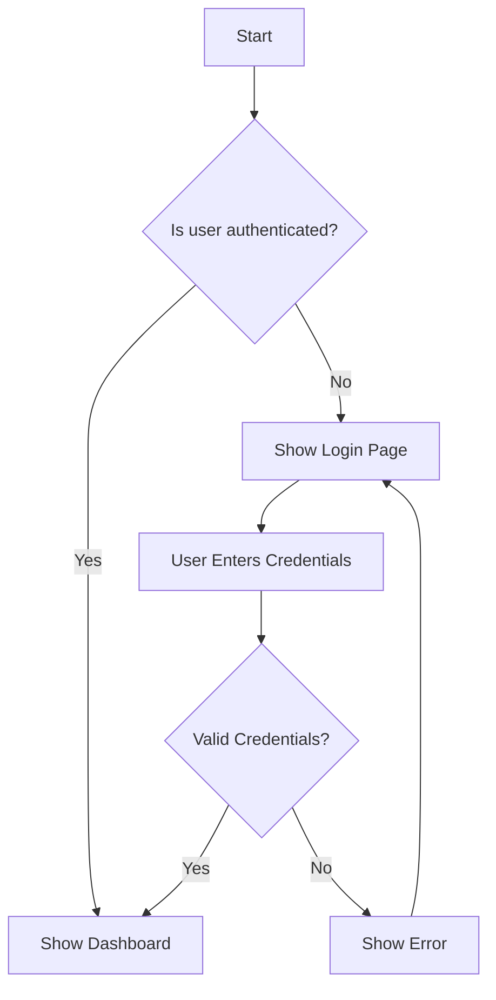
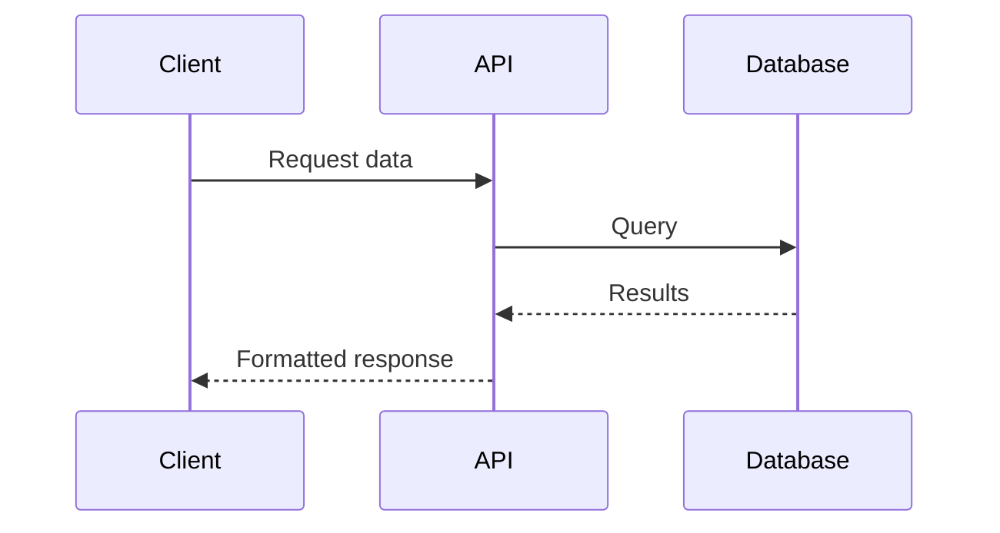
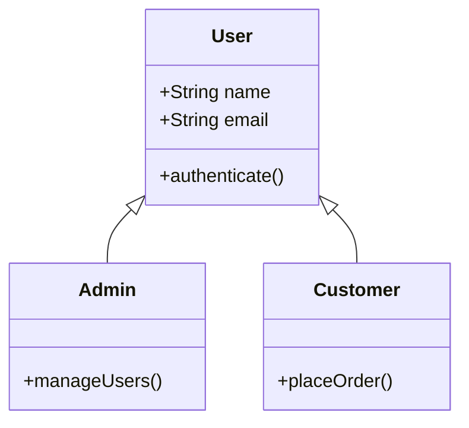
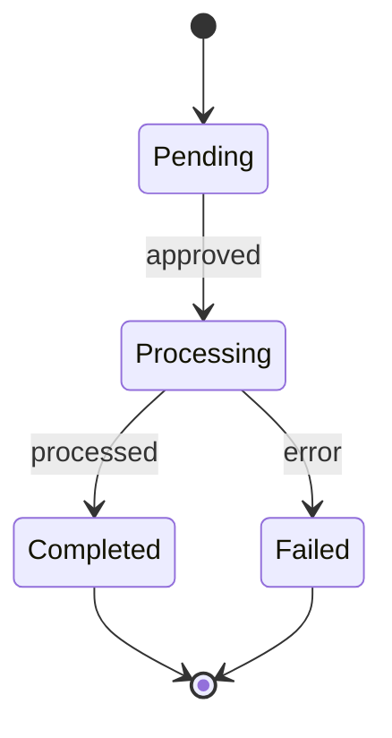
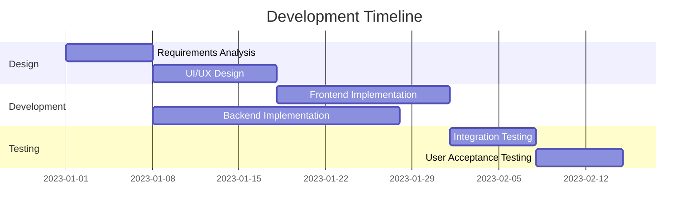
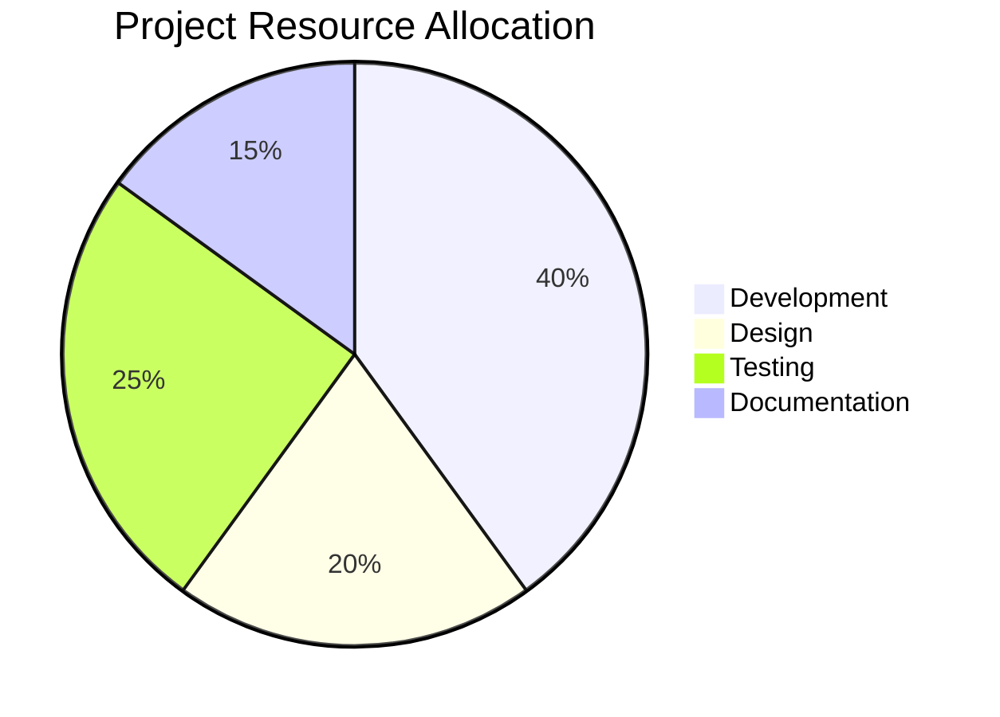

# Visual Communication & Diagram Techniques

Visual elements significantly enhance understanding of complex technical concepts. Use these techniques to create effective visual explanations.

## Mermaid Diagram Types & Applications

### Flowcharts
Best for:
- Algorithms and processes
- Decision flows
- User journeys
- State transitions

### Sequence Diagrams
Best for:
- API interactions
- Service communications
- Method call sequences
- Event flows between components

### Class/Entity Diagrams
Best for:
- Data models
- Object relationships
- System entities
- Inheritance hierarchies

### State Diagrams
Best for:
- State machines
- Workflow statuses
- Application modes
- Transition conditions

### Gantt Charts
Best for:
- Project timelines
- Task dependencies
- Resource allocation
- Implementation schedules

### Pie Charts
Best for:
- Resource distribution
- Comparative analysis
- Proportional representation
- Simple statistical visualization

## Diagram Design Principles

### Clarity & Focus
- Include only essential elements
- Use clear, descriptive labels
- Highlight the key components
- Maintain a single focus per diagram
- Use appropriate level of abstraction

### Visual Hierarchy
- Place important elements centrally or at the top
- Use size to indicate importance
- Group related items visually
- Use consistent direction for flow
- Apply visual emphasis sparingly

### Color Usage
- Use color to convey meaning, not just decoration
- Limit to 3-5 colors per diagram
- Ensure sufficient contrast for readability
- Apply consistent meaning to colors
- Consider color blindness accessibility

### Layout & Organization
- Arrange elements to minimize line crossings
- Use space effectively to group related concepts
- Maintain consistent spacing and alignment
- Follow left-to-right, top-to-bottom reading patterns
- Ensure diagram fits within viewable space

## Table Design Best Practices

### When to Use Tables
- Comparing properties across multiple items
- Displaying structured data with clear categories
- Presenting specifications or configuration options
- Showing relationships between attributes

### Table Structure Guidelines
- Use clear, descriptive headers
- Align data consistently (text left, numbers right)
- Group related information in adjacent columns
- Order rows/columns logically (alphabetical, chronological, hierarchical)
- Use appropriate cell spacing for readability

### Example: Technology Comparison Table

| Feature | Technology A | Technology B | Technology C |
|---------|-------------|-------------|-------------|
| Performance | High | Medium | Very High |
| Learning Curve | Steep | Moderate | Gradual |
| Community Support | Extensive | Growing | Limited |
| Use Cases | Enterprise, High-load | General purpose | Specialized |
| Integration | Multiple options | Standard APIs | Limited |

## Visual Explanation Enhancement

### Progressive Disclosure
- Start with simplified diagrams
- Add detail incrementally
- Use series of diagrams to show progression
- Provide zoomed-in views of complex areas
- Allow user to control detail level

### Complementary Visuals
- Combine different diagram types for complete understanding
- Use tables for structured data, diagrams for relationships
- Add code snippets to illustrate implementation
- Include screenshots for UI/UX concepts
- Provide both abstract and concrete representations

### Annotation Techniques
- Add explanatory notes to complex parts
- Use callouts to highlight important elements
- Number steps in process flows
- Include legends for symbols and colors
- Provide context with titles and descriptions